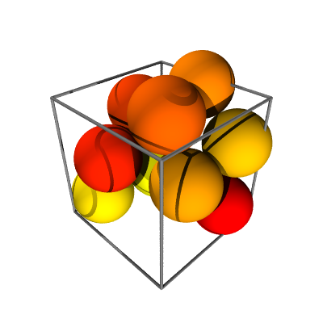

Spack
*****

.. image:: https://travis-ci.org/wackywendell/spack.svg?branch=master
    :target: https://travis-ci.org/wackywendell/spack
    :alt: Build Status

.. image:: https://readthedocs.org/projects/spack/badge/?version=latest
    :target: https://spack.readthedocs.org
    :alt: Documentation

`Code available`_ on Github, and `documentation`_ at Read the Docs. 

.. _Code available: https://github.com/wackywendell/spack

.. _documentation: https://spack.readthedocs.org

A 2D or 3D sphere packing analysis package
------------------------------------------

This package exists to enable fast, simple, and easy analysis of packings of spheres (3D) and
disks (2D). It was developed for use in a Granular Materials lab, so some of the methods reflect 
that.

Installation
------------

This library requires `numpy <http://www.numpy.org/>`_ at a minimum, which you will probably want to have installed
before installing this. Optionally, you may want `vapory <https://github.com/Zulko/vapory>`_ and `povray <http://povray.org/>`_ are required for making pretty pictures, and Voronoi tessellations are provided by `tess <https://tess.readthedocs.org>`_. The optional dependencies can be installed at any time, at which point the associated methods (:meth:`~.Packing.scene` and :meth:`~.Packing.tess`) will work.

To install, use ``pip`` (or ``easy_install``)::

    pip install --user spack

Or to install from Github_::
    
    pip install --user git+git://github.com/wackywendell/spack@master
    
.. _github: https://www.github.com/wackywendell/tess

Example Usage
-------------

Make a :class:`~spack.Packing`:

    >>> from spack import Packing
    >>> from numpy import array, pi
    >>> L = 2.0066668050219723
    >>> diameters = array([ 0.96,  0.97,  0.98,  0.99,  1.  ,  1.01,  1.02,  1.03,  1.04])
    >>> locs = array([[ 1.40776762,  1.26647724,  0.73389219],
    ...                [ 0.58704249,  2.11399   ,  1.52956579],
    ...                [ 1.75917911,  0.54290089,  1.27577478],
    ...                [ 2.13750384,  0.87508242,  0.21938647],
    ...                [ 1.07283961,  0.87692084,  1.9060841 ],
    ...                [ 0.09550267,  1.94404465,  0.56463369],
    ...                [ 1.07636871,  2.1942971 ,  0.63752152],
    ...                [ 0.49922725,  1.20002224,  1.13360082],
    ...                [-0.27724757,  1.62152603,  1.67262247]])
    >>> pack = Packing(locs, diameters, L=L)

How many contacts are in my packing?

    >>> pack.contacts()
    Contacts(Nc=25, stable=25, floaters=0)
    >>> # 25 contacts found
    >>> # 25 contacts required for stability (for a packing of 9 particles)
    >>> # 0 floaters

What are its highest resonant frequencies?
    
    >>> freqs = pack.DM_freqs()
    >>> for f in reversed(sorted(freqs)[-4:]):
    ...     print('{:.4f}'.format(f))
    0.7018
    0.6717
    0.6416
    0.6375

What does it look like? (requires `vapory` package and `povray` program)

    >>> size = 400
    >>> sc = pack.scene(rot=pi/4, camera_dist=2, cmap='autumn')
    >>> sc.render('example-packing.png', width=size, height=size, antialiasing=0.0001)

Colors indicate diameter, with floaters drawn in gray.

.. image:: example-packing.png
    :align: center
    :alt: 

Let's look at all sides, using `moviepy`:

    >>> from moviepy.editor import VideoClip
    >>> import moviepy.editor as mpy
    >>> 
    >>> duration = 10
    >>> def make_frame(t):
    ...     return (
    ...                 pack.scene(rot=(t/duration + .125)*2.*pi, 
    ...                            camera_dist=2, cmap='autumn', bgcolor=[1,1,1])
    ...                 .render(width=size, height=size, antialiasing=0.001)
    ...             )
    >>> vc = VideoClip(make_frame, duration=duration)
    >>> 
    >>> vc.write_gif("example-packing.gif",fps=24) # doctest: +SKIP

And this is the output:

.. image:: example-packing.gif
    :align: center
    :alt: 
.. image:: docs/example-packing.gif
    :align: center
    :alt: 

There are a few other methods for things like finding the backbone of the packing (:meth:`~.Packing.backbone`), the adjacency matrix (:meth:`~.Packing.neighbors`), or getting the Voronoi tessellation (:meth:`~.Packing.tess`, requires `tess`_). See the :doc:`api` for more details.

.. _tess: https://tess.readthedocs.org
